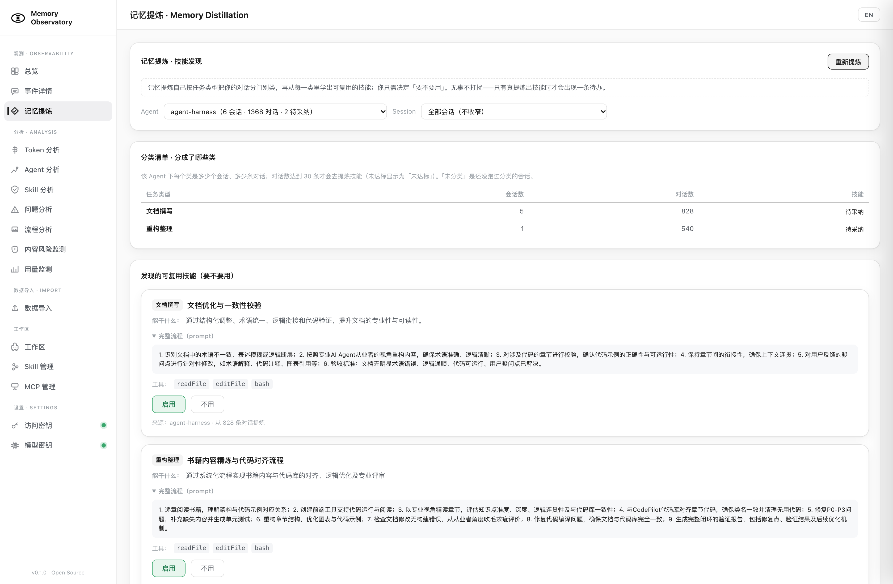

# Memory Observatory（MindSprout）

> 面向 AI Agent 记忆系统的一体化可观测性平台与智能工作台：**采集 → 存储 → 观测分析 → 记忆提炼 → 编排运行** 全链路闭环。

Memory Observatory 在 Agent 运行时旁路采集记忆操作事件（读 / 写 / 更新 / 遗忘）与上下文 Token 快照，按 OpenTelemetry 协议落库，Web 端提供记忆观测、多维分析、记忆提炼、数据导入和 Agent 工作台五大功能区；内置多 Agent 编排引擎与角色化工作流，可直接在平台内创建工作区、派发任务、实时跟踪执行过程。

**记忆提炼**是这条闭环里「往回长」的那一环：把沉淀下来的真实对话按任务类型分门别类，从每一类里提炼出可复用的技能，交给人决定「要不要用」；采纳的技能回灌进工作台技能库，下一次同类任务就能用上。详见 [记忆提炼](#记忆提炼记忆--技能的自校准闭环)。

---

## 功能全景

Web 界面（侧边栏四大功能区）：

| 分区 | 页面 | 能力 |
|---|---|---|
| **观测** | 总览 | Agent / 事件 / 会话 KPI 概览、问题告警聚合、待办入口 |
| | 事件详情 | 记忆事件流（操作/层级/Token/延迟）、会话 Turn 时间线、五区 Token 热力图、事件详情抽屉、Trace 链路树 |
| | **记忆提炼** | Agent / Session 两级筛选 → 分类清单（该 Agent 下分成了哪些类、每类多少对话）→ 技能提议卡（能干什么 / 完整流程 / 工具 / 来源）+「启用 · 不用」；「重新提炼」只针对所选 Agent |
| **分析** | Token 分析 | 分层/操作/会话/时间趋势等 8 维度聚合、延迟分位、Top10 记忆键、五区预算分布 |
| | Agent 分析 | 多 Agent 横向对比、会话对比、综合评分 |
| | Skill 分析 | Skill 调用次数 Top10、Skill Token 消耗 Top10、按 Agent 下钻 |
| | 问题分析 | 慢调用、循环震荡、频繁压缩、失败重试、遗忘风暴等异常模式自动识别与阈值判定 |
| | 流程分析 | 会话执行流程图（mermaid/G6）、关键路径、问题节点标注与详情滑块 |
| | 内容风险监测 | 记忆/对话内容风险规则扫描与命中详情 |
| **数据导入** | 数据导入 | xlsx/json 批量导入（模板下载、行级校验报告）、`.log` 文件批量多选导入（支持大模型格式化抽取）、MCP/Skill 上报接入包下载、原始事件导出（JSON/JSONL，可回灌） |
| **Agent · Playground** | Agent 对话 | 多子 Agent 工作区（工作区经理 + 员工），ReAct 工具链，SSE 实时气泡流 + 思考树，任务拆解并行派发、逐步验收 |
| | Skill 管理 | 工作区级 / Agent 级技能的增删改查与下载 |
| | MCP 管理 | MCP Server 配置、连通性测试、工具列表查看与在线调用 |

侧边栏底部「设置 · Settings」分组提供 **访问密钥** / **模型密钥** 两个入口（状态点：灰=未配置 / 绿=已配置）：「访问密钥」维护接口鉴权口令，「模型密钥」维护大模型 API Key（DashScope / OpenAI 兼容）。

**一键部署，开箱即用**：下载完整仓库后，在根目录执行 `./install.sh` 即可自动构建并启动全部服务（PostgreSQL + 后端 + nginx HTTPS 反代），无需手动配置依赖。

- 前提：已安装并启动 **Docker Desktop**（含 compose v2）；需在**仓库根目录**运行（脚本依赖同目录的 `docker-compose.yml` 与源码，不能只拷单个脚本）
- 不设 `MO_API_KEY` 为本地演示的开放模式；设置后启用接口鉴权
- 启动后浏览器打开 **https://localhost:5173**（自签名证书点"继续"即可）
- 详细步骤与参数（`--reset` / `--no-cache` 等）见下方 [快速开始](#快速开始)

---

## 架构

```
┌──────────────────────────────────────────────────────────────┐
│  Agent 进程（Python / Java / 任意语言）                         │
│  mo_sdk 拦截器 · trae_report_event.py CLI · MCP 上报包          │
└───────────────┬──────────────────────────────────────────────┘
                │ OTLP/HTTP JSON（/v1/traces）· REST（/api/v1/events）
                ▼
┌──────────────────────────────────────────────────────────────┐
│  mo-server（Spring Boot 3.4，单进程）                           │
│  ┌────────────┐  ┌─────────────┐  ┌────────────────────────┐  │
│  │ OTLP 接收   │→│ IngestQueue │→│ EventRepository        │  │
│  │ OtlpParser │  │ 有界队列削峰 │  │ 批量写库 + 30+ 查询接口 │  │
│  └────────────┘  └─────────────┘  └───────────┬────────────┘  │
│  REST API（观测/分析查询 · 数据导入 · 风险扫描）                 │
│  Agent 工作台（workbench 多Agent编排 · workflow 角色工作流）     │
│  工作区管理（workspaces · skills · mcp · 文件浏览）             │
│  外骨骼转发 /api/v1/exoskeleton/** · 采纳提议写工作台技能库      │
│  安全：ApiKeyAuthFilter（Bearer 校验）                          │
└───────────────┬───────────────────────────────┬──────────────┘
                │ JDBC                           │ /api 反代
                ▼                                ▼
┌──────────────────────────┐      ┌──────────────────────────────┐
│  PostgreSQL 16（持久卷）   │      │  mo-dashboard（nginx）         │
│  memory_events            │      │  443 TLS（自签/正式证书）       │
│  memory_snapshots         │      │  80 → 443 跳转 · 静态单页应用   │
│  memory_turns（task_type） │      │  前端统一从 mo-server static 取 │
│  memory_skill_proposals   │      └──────────────────────────────┘
│  import_log_files（去重）  │
└──────────▲───────────────┘
           │ JDBC（与 mo-server 共读同一个库）
┌──────────────────────────────────────────────────────────────┐
│  mo-exoskeleton（Spring Boot 3.4 · 记忆提炼 · 仅本机回环 8081）  │
│  ① 分类（session 粒度）→ ② 提炼（Agent × 任务类型）→ ③ 技能提议  │
│  采纳经 mo-server 落 ~/.workbench/skills/（本容器不挂工作台目录） │
└──────────────────────────────────────────────────────────────┘

  mo-server 另有本地推理依赖（语义过滤，拿不到即 fail-open）：
┌──────────────────────────────────────────────────────────────┐
│  laya-backend（仅本机回环 8770）· /health · /api/predict       │
└──────────────────────────────────────────────────────────────┘
```

**五层分工**：

| 层 | 目录 | 技术 | 职责 |
|---|---|---|---|
| 采集 | `mo_sdk/` `examples/` | Python（零依赖可选） | 拦截记忆操作、归一化为 READ/WRITE/UPDATE/EXPIRE、OTLP 上报 |
| 服务 | `mo-server/` | Java 17+ / Spring Boot 3.4 | 接收、削峰、落库、查询分析、Agent 编排、工作区管理、外骨骼转发与技能落盘 |
| 存储 | docker volume | PostgreSQL 16 | 事件 / 快照 / **对话与分类** / 技能提议 / 导入指纹持久化 |
| 提炼 | `mo-exoskeleton/` | Java 17+ / Spring Boot 3.4（零新增依赖） | 记忆提炼：对话 → 任务分类 → 可复用技能提议；**与 mo-server 共读同一个库** |
| 前端 | `mo-server/src/main/resources/static/` | 原生 HTML/CSS/JS（内联 mermaid/marked/G6） | 单页应用，nginx 托管并 HTTPS 反代 |

---

## 快速开始

### 前置要求

- Docker 20.10+ 且带 docker compose v2 插件（`docker compose version` 可输出）

### 一键启动

```bash
./install.sh
```

脚本自动完成：环境预检 → **生成配置文件 `.env`（含随机访问密钥，首次运行自动创建）** → 构建镜像 → 启动 postgres / mo-server / mo-dashboard → 健康检查轮询 → 输出访问地址与密钥。三个容器均配置 `restart: unless-stopped`，Docker/开机重启后自动恢复。

> 鉴权开箱即用，零配置：访问密钥自动生成并持久化在根目录 `.env`（已被 .gitignore 排除，不会提交），之后 `docker compose up -d` 直接生效。**本机浏览器打开 https://localhost:5173 无需输入密钥**——nginx 会对未携带密钥的请求自动注入 `.env` 中的 `MO_API_KEY`（5173 仅绑定本机回环）。要开放免鉴权模式，把 `.env` 里的 `MO_API_KEY` 置空即可；显式 export 的环境变量优先于 `.env`。

启动后：

| 服务 | 地址 | 说明 |
|---|---|---|
| **Web 界面** | https://localhost:5173 | 自签名证书，浏览器提示"不安全"点继续即可 |
| REST API | http://localhost:8080 | 查询 + 工作台接口（经 nginx，自动注入密钥） |
| OTLP 上报 | http://localhost:4318/v1/traces | SDK / 上报脚本直连入口，需携带鉴权头 |

本机浏览器打开 8080/5173 均已由 nginx 自动注入密钥，无需配置；侧边栏「访问密钥」弹窗用于从**其他设备/客户端**访问时手动输入（或查看/清除浏览器保存的 key）；SDK 与上报脚本需携带同一个 key（4318 直连入口不注入）。

调用大模型的 API Key 在侧边栏「模型密钥」配置（DashScope / OpenAI 兼容），供所有未单独绑定 Key 的 Agent（含内置工作区经理）与「.log 大模型格式化」使用；界面配置加密保存在本机并优先于 `.env` 环境变量，保存后立即生效。

### 验证一条上报

```bash
curl -s -X POST http://localhost:8080/api/v1/events \
  -H 'Content-Type: application/json' \
  -H "Authorization: Bearer $MO_API_KEY" \   # 开放模式可省略此行
  -d '{"agentId":"demo-agent","sessionId":"s1","operation":"WRITE",
       "layer":"prompt","memoryKey":"hello","memorySummary":"安装验证","tokenCount":10}'
```

刷新 Web 界面，在总览/事件详情选择 `demo-agent` 即可看到。

---

## 数据上报与导入

平台提供四种数据接入方式，均可在「数据导入」页操作或下载；同一页面还提供原始事件导出（见第 5 节）。

### 1. Python SDK（mo_sdk）

框架无关的核心库 + 拦截器，旁路采集、异常不影响主流程：

```python
from mo_sdk import MemoryObserver, OTelSpanExporter

observer = MemoryObserver(agent_id="my-agent")
observer.add_exporter(OTelSpanExporter(
    endpoint="http://localhost:4318/v1/traces",
    api_key="<MO_API_KEY>",        # 服务端启用鉴权时必填
    service_name="my-agent",
))
observer.record_event(...); observer.export()
```

属性对齐 OpenTelemetry GenAI 语义约定（`memory.*` 命名空间）。Hermes 框架可直接用 `hermes_instrumentation.py` 一键猴子补丁插桩。

### 2. 零依赖 CLI 上报

`examples/trae_report_event.py`（仅用标准库），适合 Agent 以 RunCommand 方式逐事件上报：

```bash
export MO_API_KEY=<key>            # 启用鉴权时
python3 examples/trae_report_event.py \
  --operation WRITE --layer prompt --memory-key MEMORY.md \
  --summary "读取项目记忆" --token-count 1200 --session-id my-session
# 经 nginx HTTPS 自签证书上报时加 --insecure 或 MO_INSECURE=1
```

支持 `--trace-id` / `--parent-span-id` / `--meta k=v` 链式构建 Trace。

### 3. MCP / Skill 接入包

「数据导入」页可下载针对各平台（Trae/Cursor/Cline 等）的接入包 zip，内含：`report_mcp_server.py`（stdio MCP Server，暴露 `report_memory_event` 工具）、`skill.md`（技能提示词）、MCP 配置片段与安装 README。目标 Agent 配置环境变量 `MO_SERVER` 与 `MO_API_KEY` 后，每次记忆操作自动上报。

### 4. 文件批量导入

| 方式 | 格式 | 说明 |
|---|---|---|
| 表格/JSON 导入 | `.xlsx` / `.json` | 页面下载模板填写后上传；行级校验，返回 inserted/skipped/errors 报告；`ON CONFLICT` 幂等 |
| 文件夹 `.log` 导入 | 一个或多个 `.log` | 文件选择框批量多选 `.log` 上传，MD5 指纹去重；可勾选「大模型格式化解析」（DashScope）把自由文本运行日志抽取为结构化事件；不勾选则按 JSON 数组直传 |

`test-logs/` 目录提供了三组测试日志（正常流 / 异常循环流 / JSON 直传含坏行），可在导入页框选这些 `.log` 验证效果。

### 5. 原始事件导出（可回灌）

「数据导入」页的「原始事件导出 · 可回灌」卡片，或等价的 `GET /api/v1/export/events`，把 `memory_events` 按导入契约的字段与格式导出，作为导入的对称面：

| 项 | 说明 |
|---|---|
| 过滤 | `agent` / `session` / `trace` 三个可选条件，`days` 限定时间窗口（默认 7 天，0 表示不限） |
| 格式 | `format=json` 产出 JSON 数组，可被 `POST /api/v1/import?format=json` 直接回灌；`format=jsonl` 逐行输出，适合大文件与流式入库（导入侧不认 jsonl，回灌前包成数组） |
| 字段 | snake_case，与导入契约逐字一致；`timestamp` 按 `Asia/Shanghai` 写成 `yyyy-MM-dd HH:mm:ss`，回灌不平移时间 |
| 上限 | 单次行数上限 `mo.export.max-rows`（默认 100000），超出请按 agent / session 分批导出 |
| 实现 | 服务端 `StreamingResponseBody` + JDBC 逐行回调，内存占用与导出行数无关 |

已知有损点：导入格式的时间只到秒，而库内 `ts` 带微秒，回灌后亚秒精度归零，这是导入契约带来的限制。

---

## 页面功能导览

- **总览**：Agent、事件、会话等核心 KPI；问题分析告警卡片（红=异常 / 绿=正常）一键跳转。
- **事件详情**：事件流分页表格，胶囊筛选组（Agent / Session / 时间窗口）；点击事件打开详情抽屉（基本信息、记忆摘要、同 Turn 事件、原始 JSON）；会话时间线按记忆层分泳道；Token 热力图按时间桶展示；Trace 视图渲染 Span 树（关键路径、慢 Span、孤儿 Span、记忆有效性统计）。
- **记忆提炼**：选定 Agent（可再收窄到某个 Session）→ 看这个 Agent 下「分成了哪些类、每类多少对话」→ 看每类提炼出的技能卡（能干什么 / 完整流程 / 工具 / 来源）并决定「启用 / 不用」；「重新提炼」只针对当前所选 Agent。未选 Agent 时不展示类清单——不拿「全库聚合」冒充「这个 Agent 的分类」。
- **Token 分析**：Top 会话、24h 分布、操作×层级矩阵、延迟分位数、Top10 记忆键、读写比率、直方图、日趋势；五区快照（System/Task/Memory/Tool History/Free）预算分布。
- **Agent 分析**：多 Agent 综合对比（事件量、Token、延迟、失败率）、同 Agent 会话间横向对比。
- **Skill 分析**：Skill 调用次数 Top10 与 Token 消耗 Top10 卡片，支持全局 / 单 Agent 视角。
- **问题分析**：基于阈值自动识别慢调用、技能循环震荡、上下文压缩过频、调用失败、遗忘风暴等模式；问题节点详情含时间倒序红点锚点条，点击红点直达事件位置。
- **流程分析**：把会话重建为流程图（正常 ✅ / 异常 ⚠️ / 恢复 🔄 / 放弃 ❔ 图标标注），问题节点红色高亮，支持 mermaid 与 G6 两种渲染。
- **内容风险监测**：按规则扫描记忆与对话内容，输出风险命中列表与详情。
- **Agent 对话（工作台）**：工作区式目录（`.workbench` manifest），经理 Agent 将需求拆解为子任务并行派发给员工 Agent；SSE 流式推送气泡对话与可拖拽/收起的思考树；阶段完成后弹出评审反馈（优点/不足/结论）与产物预览，支持「重新生成」「进入下一阶段」。
- **Skill / MCP 管理**：技能与 MCP Server 的工作区级/Agent 级 CRUD；MCP 支持连通性测试、工具枚举与在线试调。

---

## 记忆提炼（记忆 → 技能的自校准闭环）

**一句话**：把沉淀在库里的真实对话，按任务类型分门别类，从每一类里提炼出**一套完整可复用的技能**，交给人决定「要不要用」；采纳的写进工作台技能库，下一次同类任务就能用上。

平台其余部分在回答「发生了什么」，记忆提炼在回答「**下次该怎么做**」——它是把观测数据变成能力增量的那一环。

### 核心：两次 LLM 判定 + 一次人拍板

```
memory_turns（mo-server 采集落库的对话）
      │
      │ ① 分类 · session 粒度 · 1 次 LLM 调用 / 会话
      │    判一个封闭词表里的 task_type + 一句中文备注
      │    POST /api/v1/exoskeleton/tasks/classify
      ▼
memory_turns.task_type（8 个封闭取值之一；判不出就留 NULL 下轮重试，不猜）
      │
      │ ② 提炼 · Agent × 任务类型 粒度 · 1 次 LLM 调用 / 类
      │    只把「该类对话原文」交给模型，严格口径：完整闭环才算技能，零散碎片不算
      │    POST /api/v1/exoskeleton/skills/discover?agent=<id>
      ▼
memory_skill_proposals（PENDING / ADOPTED / DISMISSED）
      │
      │ ③ 人拍板 · 记忆提炼页点「启用 / 不用」
      │    POST /api/v1/exoskeleton/skills/{id}/adopt | /dismiss
      ▼
~/.workbench/skills/<agent-slug>--<skill-id>.yaml（全局技能库，id 带 Agent 前缀）
```

| 环节 | 粒度 | 为什么是这个粒度 |
|---|---|---|
| ① 分类 | **session** | 一个会话共享一个「在做什么事」，逐轮判会碎 |
| ② 提炼 | **Agent × task_type** | 技能是「一类任务怎么做」的手艺，而不同 Agent 干的活、留下的做法各异；把几十个 Agent 混在一起按 task_type 提炼，得到的是拼接过的伪手艺。故先按 Agent 切开，再在刀内分类 |
| ③ 采纳 | **人** | 把技能装进工作台是一次真实的能力变更，必须人拍板 |

### 三条纪律

1. **不算就不写**：LLM 不可达或解析失败 → 该会话/该类本轮不产出，留待下轮，**不猜一个兜底值塞进去**。
2. **单条失败不影响整批**：一个会话/一个类抛异常只记日志、计入 failed，继续下一个。
3. **绝不自行启用**：提炼只落 `PENDING` 提议，永远不自己把技能写进工作台。

### 少打扰（幂等）

`memory_skill_proposals` 用「证据指纹」`sha256(agent_id + task_type + 对话摘要)` 判重：指纹没变 → 本轮**不送 LLM、不重复落**（既不重复打扰人，也不白花一次模型调用）；已采纳的不再动；已点过「不用」但证据变了的，允许重新提上来。所以「重新提炼」可以放心反复点。

### 关键接缝

- **共读一个库**：mo-exoskeleton 与 mo-server 共用同一个 PostgreSQL。对话原文、分类结果、技能提议都在库里，外骨骼不新建采集通路。
- **落盘必须经 mo-server**：外骨骼容器不挂载工作台的 `~/.workbench`（那里有加密密钥），所以「采纳」由 mo-server 侧的编排器取回提议、写进技能库；外骨骼只负责「提炼」与「提议」。
- **转发层如实报错**：mo-server 对 `/api/v1/exoskeleton/**` 是纯转发，外骨骼不可达时返回 **503**，不降级成空列表——页面该显示「不可达」就显示，不假装「没有技能」。

### 后端保留、人面撤下

早先版本还有一处「决策卡片」人面（规则上线审批台 + 三层闸门 + 规则生命周期）：后端代码与单测（`cards/` `promote/` `audit/` `criteria/`、`memory_cards` / `memory_rules` 表）**原样保留**，页面入口已撤下。它们与记忆提炼共用「判据/报表侧」这套设施（同一个 LLM 通道、同一套取数），留着是为了将来需要时能直接接线，而不是要维护两套。

### 启用与配置

记忆提炼需要一条 LLM 通道（OpenAI 兼容端点），留空则页面如实显示「未配置」，不影响其余功能：

```bash
# .env（与 mo-server 共用同一组变量）
LLM_BASE_URL=http://host.docker.internal:11434/v1   # 例：本机 Ollama
LLM_MODEL=qwen3:latest
LLM_API_KEY=ollama
LLM_REASONING_EFFORT=none                            # 关思考链：思考模型在长会话上会超时
```

| 参数 | 默认 | 说明 |
|---|---|---|
| `mo.exoskeleton.tasks.max-sessions-per-run` | 200 | 每轮最多分类多少个会话（每会话 1 次 LLM 调用） |
| `mo.exoskeleton.tasks.digest-max-chars` | 30000 | 会话摘要送模型的字符上限；超了按 turn 均匀抽样（首尾必取） |
| `mo.exoskeleton.skills.min-turns` | 30 | 样本门槛：该类 turn 数低于它不提炼，清单里显示为「未达标」 |
| `mo.exoskeleton.skills.max-classes-per-run` | 8 | 每轮最多提炼几个类（每类 1 次 LLM 调用），给成本兜底 |

> 分类收尾会自动触发提炼——但只对「本轮真正有新分类的 Agent」逐个跑一轮；证据没变的类会在提炼里被整类跳过，代价很小。

---

## 界面预览

### 观测

**总览** — Agent / 事件 / 会话 KPI 与问题告警聚合


**事件详情** — 记忆事件流、会话时间线、胶囊筛选与详情抽屉


**记忆提炼** — Agent × 任务类型分类清单、待采纳技能提议与技能卡详情（能干什么 / 完整流程 / 来源）



**记忆层级** — 五层记忆结构与 Token 分布


### 分析

**Token 分析** — 多维度聚合、延迟分位、Top10 记忆键与五区预算


**Agent 分析** — 多 Agent 横向对比与综合评分


**Skill 分析** — Skill 调用次数与 Token 消耗 Top10


**问题分析** — 慢调用 / 循环震荡 / 频繁压缩 / 遗忘风暴自动识别


**流程分析** — 会话执行流程图与关键路径标注


**内容风险监测** — 记忆/对话内容风险规则扫描与命中详情


### 数据导入

**数据导入** — xlsx/json 批量导入、`.log` 文件批量多选导入与接入包下载


### Agent · Playground

**Agent 工作台** — 多子 Agent 工作区、SSE 气泡流与思考树


**Skill 管理** — 工作区级 / Agent 级技能维护


---

## 配置与环境变量

| 变量 | 作用于 | 默认 | 说明 |
|---|---|---|---|
| `MO_API_KEY` | mo-server + mo-dashboard | `.env` 自动生成 | `/api/**`、`/v1/**` 强制 `Authorization: Bearer <key>`。**首次运行 `./install.sh` 自动生成随机密钥并写入根目录 `.env`**（compose 自动加载，无需手动 export）；nginx 会把它自动注入未携带密钥的本机浏览器请求（5173 零配置）；在 `.env` 中置空则为开放模式（仅本地演示） |
| `DASHSCOPE_API_KEY` | mo-server | 空 | `.log` 导入「大模型格式化解析」与未绑定 Key 的 Agent（含工作区经理）调用模型所需；也可在工作区侧边栏「模型密钥」界面配置（加密落盘，优先于本环境变量） |
| `LLM_BASE_URL` / `LLM_MODEL` / `LLM_API_KEY` | mo-server + mo-exoskeleton | 空 | OpenAI 兼容的模型端点（如本机 Ollama `http://host.docker.internal:11434/v1`）。mo-server 用它跑工作台 Agent，mo-exoskeleton 用它跑**记忆提炼**（任务分类 + 技能提炼）。留空则记忆提炼如实报「未启用」，不阻塞其余功能 |
| `LLM_REASONING_EFFORT` | mo-exoskeleton | `none` | 关掉思考链（Ollama 的 `reasoning_effort`）。Qwen3 等思考模型在中长上下文下会生成数千 token 推理链，长会话必然超时；留空则不发该字段 |
| `MO_EXOSKELETON_BASE_URL` | mo-server | `http://mo-exoskeleton:8081` | 记忆提炼服务基址；mo-server 的 `/api/v1/exoskeleton/**` 转发层据此取数。刻意不 `depends_on`：外骨骼没起来时应如实回 **503**，而不是降级成空列表 |
| `MO_DB_USER` / `MO_DB_PASSWORD` | postgres + mo-server | `mo` / `mo` | PostgreSQL 账号口令。**生产部署务必设置强口令**：`export MO_DB_PASSWORD='...'` 后再启动（注意：`POSTGRES_PASSWORD` 仅在数据卷首次初始化时生效，改口令需 `./install.sh --reset` 或手动改库） |
| `MO_AGENT_CRYPTO_SECRET` | mo-server | 自动生成 | 工作台 Agent Key 落盘加密密钥（AES-GCM）。留空时首次启动在挂载目录 `~/.workbench/.crypto-secret`（权限 0600）生成随机密钥并持久化；生产环境建议显式设置以便备份/迁移 |
| `MO_HOST_MOUNT_SRC` / `MO_HOST_MOUNT_DST` | mo-server 挂载 | `$HOME` / `$HOME` | 工作台可浏览的宿主机目录，见下方隐私说明 |

**宿主机文件访问与隐私边界**：compose 默认把宿主机**整个家目录**（`$HOME`）挂载进容器——工作台文件夹浏览器与工作区 Agent 因此可读写家目录下的全部文件（Documents/Desktop 等），工作台配置 `~/.workbench`（含加密密钥文件 `.crypto-secret`）也落在宿主机、容器重建不丢。这是本地单机工具的便利性取舍；在多用户机器或生产环境应收窄挂载范围，只暴露工作目录：

```bash
export MO_HOST_MOUNT_SRC="$HOME/Documents"
export MO_HOST_MOUNT_DST="$HOME/Documents"
MO_API_KEY="..." docker compose up -d
```

**端口暴露**：所有端口（PostgreSQL 5432、后端直连 8080/4318、Web 入口 5173）默认只绑定 `127.0.0.1`，局域网不可见；浏览器统一走 nginx 的 HTTPS 入口 5173。如需从其他设备访问，自行修改 `docker-compose.yml` 中 5173 的绑定并评估风险（工作台可读写挂载的宿主机目录）。

**TLS 证书**：mo-dashboard 首次启动在 `mo-certs` 卷中自动生成自签名证书（CN=localhost，10 年有效）；生产环境把正式证书挂载为该卷下的 `tls.crt` / `tls.key` 即可，无需改镜像。

> 安全建议：生产部署时安全组仅放行 443 端口，8080/4318/5432 不对公网暴露；上报流量统一经 nginx HTTPS，并设置 `MO_API_KEY` / `MO_DB_PASSWORD` / `MO_AGENT_CRYPTO_SECRET` 三个密钥。

---

## 目录结构

```
memory-observatory/
├── install.sh                     # 一键安装启动（预检/构建/健康检查/输出指引）
├── docker-compose.yml             # postgres + laya-backend + mo-server + mo-exoskeleton + mo-dashboard 编排
├── laya-backend/                  # 语义过滤推理后端（本项目自有代码，Apache-2.0）
│   ├── server.py                  #   精简 HTTP 后端（/health + /api/predict）
│   ├── requirements.txt           #   laya==0.3.6（运行时从 PyPI 装，不随仓库分发）
│   ├── Dockerfile                 #   容器镜像（CPU torch + 国内源 + HF 镜像）
│   ├── LICENSE                    #   Apache-2.0 全文（本目录适用许可）
│   └── NOTICE                     #   来源 / 许可 / 名称使用 / 运行时依赖说明
├── scripts/                       # 运维脚本（check-laya / setup-laya-backend / mo-static-sync 等）
├── mo_sdk/                        # Python 采集 SDK（core/collector/exporter/interceptors）
├── examples/
│   ├── otel_demo.py               # OTLP 上报演示
│   ├── trae_report_event.py       # 零依赖事件上报 CLI
│   └── trae_importer.py           # 历史会话日志批量导入
├── test-logs/                     # .log 导入测试样本
├── hermes_instrumentation.py      # Hermes 框架一键插桩示例
├── mo-server/                     # Java 服务端
│   └── src/main/
│       ├── java/io/memobservatory/
│       │   ├── server/            # 观测域：api / receiver / ingest / storage
│       │   │                      #   model / excel / flow（流程分析）/ risk / security
│       │   │                      #   semantic（laya 语义过滤层）
│       │   └── agentloop/         # 工作台域：
│       │       ├── workbench/     #   多 Agent 编排（经理/员工、SSE 对话、思考树）
│       │       ├── workflow/      #   角色化工作流引擎（门禁验收）
│       │       └── workspace/     #   工作区/技能/MCP/文件浏览管理
│       └── resources/
│           ├── application.yml    # 服务配置
│           ├── schema.sql         # 建表脚本
│           └── static/index.html  # 前端单页应用（唯一来源，nginx 与 Spring 共用）
├── mo-exoskeleton/                # 记忆提炼服务（Java 17+ / Spring Boot 3.4，与 mo-server 共读同一个库）
│   └── src/main/
│       ├── java/io/memobservatory/exoskeleton/
│       │   ├── tasks/             # ① 任务分类：session 粒度判 task_type（LLM，封闭词表）
│       │   ├── skills/            # ② 技能提炼与提议库（Agent × task_type，证据指纹幂等）
│       │   ├── api/               #    /api/v1/exoskeleton/** 控制器
│       │   ├── model/             #    看板 / 提议 / 报表 record
│       │   ├── cards/ promote/    # ③ 后端保留、人面撤下：决策卡片与三层晋升闸门
│       │   └── audit/ criteria/   #    规则生命周期与判据重算
│       └── resources/
│           ├── application.yml    # 服务配置（LLM 通道、样本门槛、预算上限）
│           └── schema.sql         # 本模块建表（IF NOT EXISTS，幂等）
├── mo-dashboard/                  # nginx 镜像：Dockerfile / nginx.conf(HTTPS反代) / entrypoint.sh
└── ARCHITECTURE.md                # 分层架构、数据流、Trace 契约、数据库 Schema 详解
```

---

## 本地开发（不用 Docker）

```bash
# 1. 启动 PostgreSQL（或复用 compose 里的 postgres 容器）
# 2. 运行服务端
cd mo-server
mvn -s settings.xml spring-boot:run
#    http://localhost:8080 提供 API 与前端静态页（热更静态资源可用 scripts/mo-static-sync.sh）

# 3. 跑记忆提炼（可选；连本机 Ollama 时 base-url 用 localhost）
cd mo-exoskeleton
LLM_BASE_URL=http://localhost:11434/v1 LLM_MODEL=qwen3:latest mvn -s ../settings.xml spring-boot:run
#    http://localhost:8081 — 与 mo-server 共读同一个库；容器内跑则用 host.docker.internal

# 4. 产生演示数据
python examples/otel_demo.py
```

常用命令：`docker compose logs -f`（看日志）、`docker compose down`（停止，数据保留）、`./install.sh --reset`（清库重建）。

---

## 文档

- [ARCHITECTURE.md](./ARCHITECTURE.md) — 分层架构、数据流、Trace 契约、数据库 Schema 详解
- [docs/](./docs) — 数据模型 V2 设计（五层架构 / 输入契约 / 集成计划）等
- 数据契约规范：`docs/spec/mospec.md`（MOSpec v0.1）
- [THIRD_PARTY_NOTICES.md](./THIRD_PARTY_NOTICES.md) — 第三方开源依赖与许可证致谢

## License

本项目整体为 [MIT License](./LICENSE) — 可自由使用、修改、分发与商用，保留版权声明即可。

**一处例外**：`laya-backend/` 目录按 **Apache License 2.0** 分发（与 laya 生态保持一致），
许可证全文与说明见 [`laya-backend/LICENSE`](./laya-backend/LICENSE) 与
[`laya-backend/NOTICE`](./laya-backend/NOTICE)。两许可证均为宽松型、互相兼容。

> `laya-backend/server.py` 是**本项目自有代码**，改编自同一作者在 laya 工作副本中编写的
> `java/backend/server.py`（该文件从未提交到上游仓库）。laya 是本项目的**运行依赖**，
> 不是本代码的来源。

> **名称与商标**：laya 与 Convai Innovations 是其各自权利人的名称/商标，本项目对名称的
> 使用仅为指明技术依赖与来源；本项目与 laya 官方不存在隶属、赞助或背书关系。

其余第三方依赖及其许可证见 [THIRD_PARTY_NOTICES.md](./THIRD_PARTY_NOTICES.md)。
